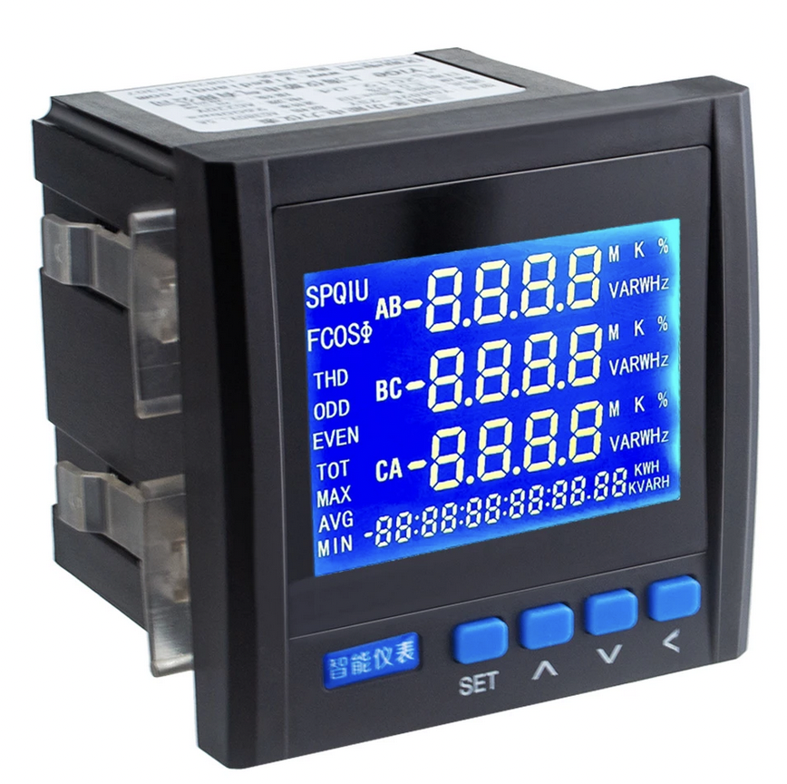

# ⚡ ModBus ESP32 reader for a cheap chinese power meter

This repo details how to use a [Saola-1 ESP32S2 board](https://docs.espressif.com/projects/esp-idf/en/latest/esp32s2/hw-reference/esp32s2/user-guide-saola-1-v1.2.html) coupled with [a RS485 transceiver from
LinkSprite](http://shieldlist.org/linksprite/rs485) and connect it to Espressif's IoT cloud platform: [RainMaker][rainmaker].

There are several branches, all of them with custom setups that work
with PlatformIO IDE with varying degrees of success:

## 🎋 Branches

* master: FreeModbus from ESP-IDF framework with PVoutput.org and RainMaker
    support.
* emodbus: [eModbus][emodbus] with Arduino, first time I got the Modbus holding registers listed thanks to [this eModbus discussion thread][emodbus_hardware_discussion].
* arduino-rainmaker: Same as emodbus, but trying to mix in RainMaker, ultimately switching to ESP-IDF (on `master`) after realising that Arduino support for RainMaker is in the works at the time of writing this.

## 🤖 Hardware setup

The hardware setup is very similar to [this eModbus hardware example thread][emodbus_hardware_example] with a couple of notable differences:

1) The use of a [ttl level converter][ttl_level_converter] between the MAX458CPE RS485 (5V level) transceiver and the Espressif board (which is 3.3V level).
2) RE/DE circuitry is handled by the LinkSprite shield instead of [via software with `REDEPIN`][redepin]. This is because [the shield has a transistor-based automatic switching between transmitting and receiving][auto_rede].

Here's a picture at some of the hardware specs from the power meter:

## 🖥️ Code structure

The protocol used on top of RS485 is Modbus-RTU with 8N1 parity and with this code is acting as a `master` and the power meter as `master`.

* `app_modbus.c`: ModBus RTU code
* `app_rmaker.c`: RainMaker setup for parameters and updates.
* `app_time.c`: PVoutput.org time and date formatting for watts submission.
* `app_rgbled.c`: Nothing to see here, move along XD
* `platformio.ini`: Embeeded certs for RainMaker and other flashing/building goodies.

## ✋ How can you contribute?

1. Review your own power meter's manual and find the register(s) listing.
3. Come up with a way to share this codebase with other third party (custom) ModBus power meter definitions and submit a pullrequest with [CID characteristics like mine here](https://github.com/brainstorm/yigedianqi-modbus/blob/f6a4d453bac206fb2ed3160085f9e9adee2a0960/src/app_modbus.c#L120-L161).
4. Code review, audit and clean my messy code, specially the use of global variables and **substitute it with proper FreeRTOS queues, semaphores and mutexes instead**.

## 🌀 Random notes

There are a few vague, vestigial references online about this power meter:

1. There's a [youtube][youtube_usage] video showing the default setup password and some basic usage/configuration.
2. A possible company spinoff, [from yiGedianqi to yiHedianqi][possible_company_spinoff]?
3. Several [Amazon customers rating this meter][amazon_power_meter_ratings] and pointing out that it only comes with a chinese manual (true story).

[youtube_usage]: https://www.youtube.com/watch?v=22_Wp99j8_U
[possible_company_spinoff]: http://www.yihedianqi.com/
[amazon_power_meter_ratings]: https://www.amazon.com/3-Phase-Electric-Voltage-Multifunction-Frequency/dp/B078NRNM37
[emodbus_hardware_discussion]: https://github.com/eModbus/eModbus/discussions/166
[rainmaker]: https://rainmaker.espressif.com
[emodbus]: https://emodbus.github.io
[emodbus_hardware_example]: https://github.com/eModbus/eModbus/discussions/112#discussion-3650333
[ttl_level_converter]: https://hackaday.com/2016/12/05/taking-it-to-another-level-making-3-3v-and-5v-logic-communicate-with-level-shifters/
[redepin]: https://github.com/eModbus/eModbus/blob/2c740aa0960328fb0851ab0ff771236b14ed7838/examples/RTU04example/main.cpp#L21
[auto_rede]: https://docs.espressif.com/projects/esp-idf/en/latest/esp32/api-reference/peripherals/uart.html#circuit-c-auto-switching-transmitter-receiver